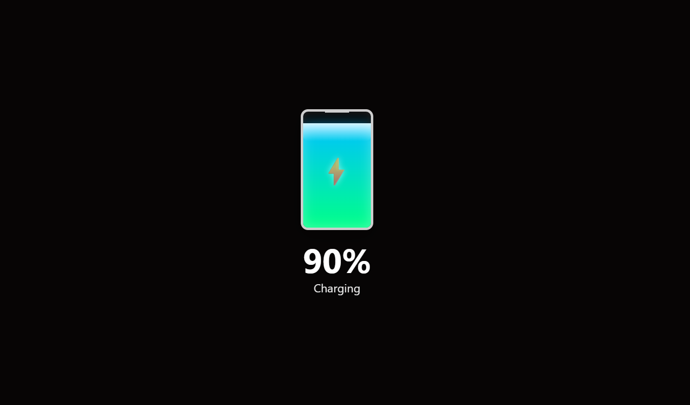
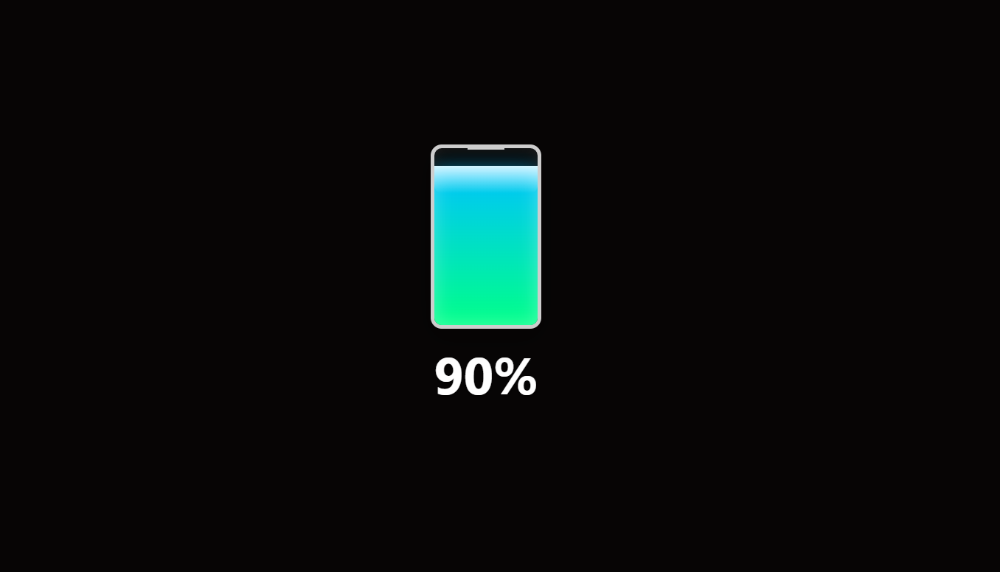

# Battery-Indicator Using Battery Status API

A sleek battery visualization tool for your web projects — shows live battery level, status, and charging state with a clean UI.

---

## 📸 Preview

_Screenshots showing different battery states for clarity._

- **While Charging:**  
  

- **While Not Charging:**  
  

---

## 📂 Folder Structure
    
    ├── .idea
        ├── .gitignore
        ├── misc.xml
        ├── modules.xml
        └── vcs.xml
    ├── README.md
    ├── battery-test.iml
    ├── images
        ├── charging.png
        └── disconnected.png
    └── index.html

## ⚙️ How It Works

This project uses the **Battery Status API** (`navigator.getBattery()`) to display real-time battery information:

- **Battery Level** — shown as a filling bar and percentage.
- **Charging Status** — highlights with style when plugged in.
- **Low Battery Warning** — applies visual cues when level drops below 20%.

---

## 🚀 Live Demo

You can **run this locally**:

1. Clone the repo
2. Open `index.html` in your browser  
   _Best tested in Chrome or Firefox_

---

## 🧠 Key Features

- Dynamic updates for **level** and **charging status**
- Visual styling using CSS classes (`low`, `medium`, `high`, `charging`)
- Easy-to-modify structure for custom enhancements

---

## 🛠️ Development

- HTML, CSS, and plain JavaScript setup
- Leverages `BatteryManager` events:
    - `levelchange`
    - `chargingchange`

---
